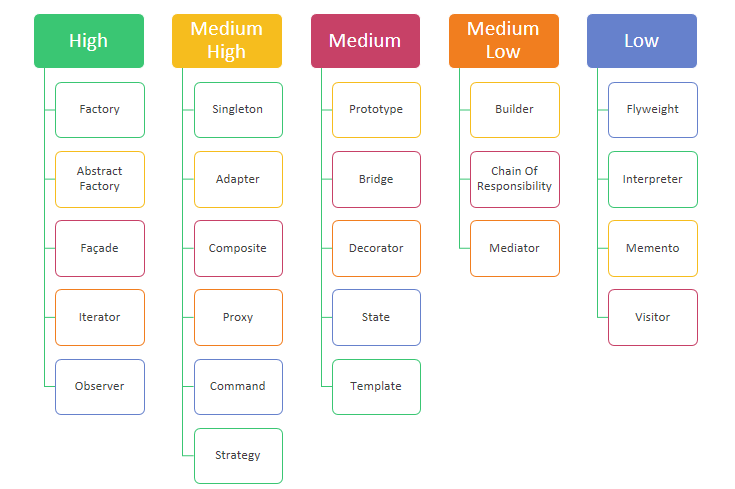

>In the context of software design, a design pattern is a reusable solution to a commonly occurring problem.

The GoF (Gang of Four) team (Erich Gamma, Ralph Johnson,  John Vlissides and Richard Helm) established 23 patterns and classified them into 3 types.

- Creational pattern
	- Factory
	- Abstract Factory
	- Singleton
	- Builder
	- Prototype
- Structural pattern
	- Adapter
	- Bridge
	- Composite
	- Decorator
	- Facade
	- Flyweight
	- Proxy
- Behavioral pattern
	- Chain Of Responsibility
	- Command
	- Interpreter
	- Iterator
	- Mediator
	- Memento
	- Observer
	- State
	- Strategy
	- Template
	- Visitor
 
Not all patterns are equally or highly used. Here is the pattern list grouped by their usage.

